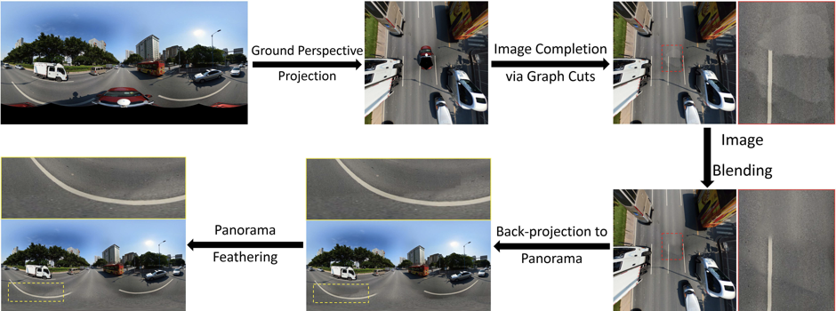
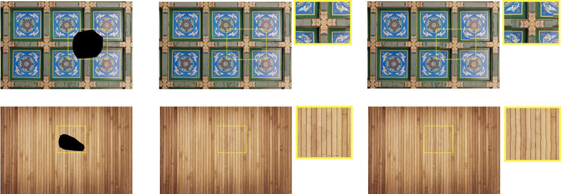
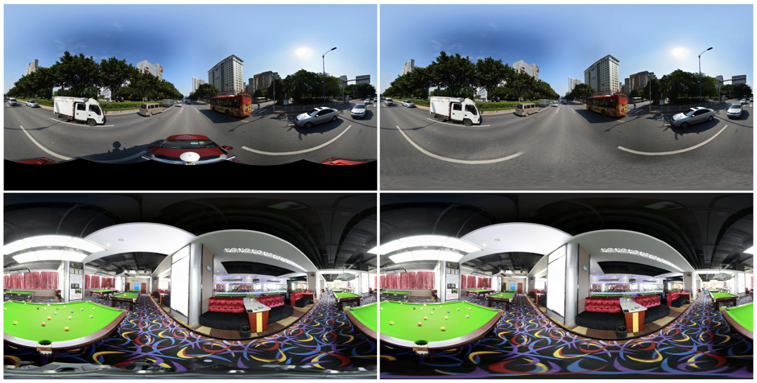

# panoramaCompletion
This file is the code for the experimental code for my paper.
It's divided in 2 parts: the vs-matlab part and the QT version part.

The QT version is more stable than the vs-matlab part.

I wrote the kd-tree part to get similar patch to find the potential patch for the hole.
Then I use the graph-based code to optimize the hole area.

The result can be seen on the paper "A UNIFIED BLENDING FRAMEWORK FOR PANORAMA COMPLETION VIA GRAPH
CUTS"

### Method Progress

### Effect image
* graph cuts comparison: left is the original image, the median is effect with our improved graph cuts, the right is the effect from `He and Sun (2014)` 

* Effect: left is original image, the right is our panorama completion effect 

